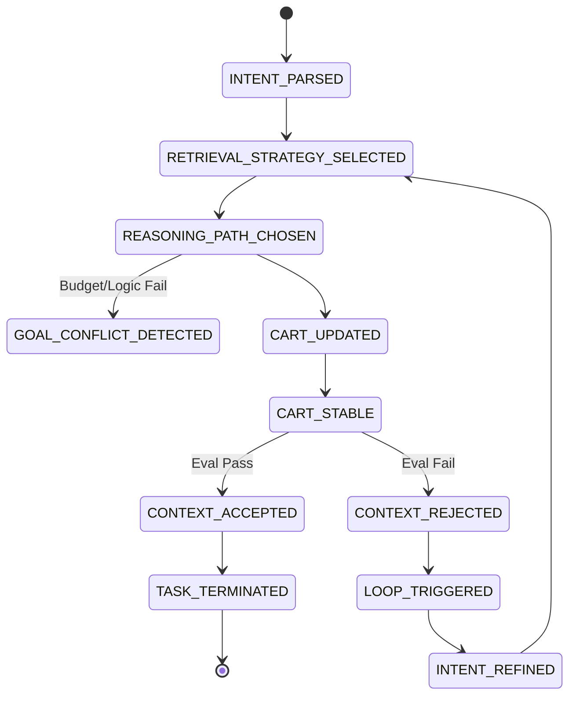

# Shop-By-Intention: Design & Evaluation

## Section 1: System Overview

### Problem Being Solved
Traditional e-commerce platforms rely on simplistic keyword matching. When a user searches for "a home office setup under $1000", conventional systems fail because they don't understand the semantic grouping of "setup" (desk + chair + monitor), nor do they intrinsically enforce the composite budget across multiple items. Shop-By-Intention solves this by employing a multi-agent AI architecture that understands natural language intent, dynamically pairs complementary products, and autonomously curates a complete shopping cart that adheres to explicit logical and financial constraints.

### Why Intent-Driven and Agentic Behavior Matters
An intent-driven system shifts the cognitive load from the user to the machine. Users express problems ("I need a podcaster setup") rather than discrete solutions ("Buy USB microphone"). Agentic behavior is strictly required to fulfill this because the solution space requires iterative reasoning: retrieving candidates, evaluating combinations, checking budgets, and looping back if a critical component (like a microphone stand) was missed in the first pass.

### Scope and Limitations
**Scope:** The system is bounded to a finite `product_catalog.json` featuring technology and office equipment.
**Limitations:**
*   Currently relies on local, synchronous `sentence-transformers` for embedding generation, which is not optimized for massive throughput compared to a dedicated vector database.
*   The system operates purely textually and relies heavily on the LLM's spatial reasoning to understand complementary items (e.g., a mouse pairs with a laptop, not a webcam). 
*   Hallucination risks are controlled via a rigid taxonomy, but extreme edge-case queries outside the taxonomy bound may result in intent extraction failure.

---

## Section 2: AI Architecture

### High-Level System Architecture

```mermaid
graph TD
    User([User Query]) --> API[FastAPI /shop endpoint]
    
    subgraph Agentic Loop [Loop Controller Orchestration]
        Intent[Intent Agent] --> Retrieval[Retrieval Agent]
        Retrieval --> Reasoning[Reasoning Agent]
        Reasoning --> Cart[Cart Agent]
        Cart --> Eval[Evaluation Agent]
    end
    
    API --> Agentic Loop
    
    subgraph State & Memory
        Taxonomy[(Taxonomy Limits)] -.-> Intent
        VectorDb[(Sentence Transformers / Catalog)] -.-> Retrieval
        CartState[(Global Cart State)] <--> Cart
        EventLog[(ThreadLocal Event Trace ID)] -.-> Agentic Loop
    end
    
    Eval -- "Refine/Loop" --> Intent
    Eval -- "Complete" --> API
```

### End-to-End Data Flow
1. **Ingestion:** User submits a natural language context query.
2. **Context Injection:** `event_context` generates a unique `session_id` to structurally bind all telemetry across the entire request lifecycle.
3. **Intent Parsing:** The query is bounded against a strict `taxonomy.json` configuration config to extract Category, Purpose, Preferences, and Budget without hallucinated tags.
4. **Vector Retrieval:** The parsed intent builds a semantic query string. Local models calculate cosine similarity against catalog items, filtering explicitly requested categorical bounds first.
5. **Logic & Cart Building:** Candidates are evaluated for relevance and budgetary compliance. Approved items are aggregated into the `CartState`.
6. **Evaluation & Looping:** The final cart is assessed. If the cart critically fails the intent (e.g., missing a core "setup" piece), an `AgenticEvent` triggers the loop to restart with the refined intent.

---

## Section 3: Agent Architecture

### 1. Intent Agent
*   **Responsibility:** Translates unstructured text into structured, strict JSON.
*   **Inputs/Outputs:** Input: Raw Query String. Output: `IntentState` (Category, Purpose, Budget, Preferences).
*   **Decision Boundaries:** Explicitly barred from hallucinating tags. Must select strictly from predefined Arrays (`config/taxonomy.json`) or return `null`.
*   **Triggered Events:** `INTENT_PARSED`, `INTENT_UNCERTAIN`

### 2. Retrieval Agent
*   **Responsibility:** Fetches relevant semantic matches from the product catalog.
*   **Inputs/Outputs:** Input: `IntentState`. Output: List of Dict `candidates`.
*   **Decision Boundaries:** If a literal `category` is parsed, it ruthlessly filters the catalog before semantic search. If `category` is null (e.g. "gaming setup"), it searches the entire catalog purely by `purpose`.
*   **Triggered Events:** `RETRIEVAL_STRATEGY_SELECTED`

### 3. Reasoning Agent
*   **Responsibility:** Logical filtering of retrieved candidates based on constraints.
*   **Inputs/Outputs:** Input: `IntentState` + `candidates`. Output: Sorted/Filtered list of items.
*   **Decision Boundaries:** Discards items that single-handedly violate the user's explicit budget cap. Resolves categorical padding (e.g., rejecting an accidental laptop recommendation for a camera query).
*   **Triggered Events:** `REASONING_PATH_CHOSEN`, `GOAL_CONFLICT_DETECTED`

### 4. Cart Agent
*   **Responsibility:** State mutation and financial aggregation.
*   **Inputs/Outputs:** Input: Reasoned Candidates. Output: `CartState` (Items array, Total_Cost).
*   **Decision Boundaries:** Sequentially adds items. If adding the next best item breaches the global mathematical budget limit, it halts addition.
*   **Triggered Events:** `CART_UPDATED`, `CART_STABLE`

### 5. Evaluation Agent
*   **Responsibility:** Quality Assurance and goal verification.
*   **Inputs/Outputs:** Input: `CartState` + `IntentState`. Output: Dict `evaluation_result` (Success bool, missing elements string).
*   **Decision Boundaries:** Determines if the combined items holistically satisfy the original user request. 
*   **Triggered Events:** `CONTEXT_ACCEPTED`, `CONTEXT_REJECTED`

---

## Section 4: Agentic AI Events Model (CRITICAL)

### Event Taxonomy
The system utilizes a central `AgenticEvent` schema logging `session_id`, `event_type`, `agent`, `input_state`, `decision`, and `output_state`.

### Event Flow Model



### Event Control Flow
*   **Events Triggering Loops:** `CONTEXT_REJECTED` specifically signals the Loop Controller that the agent failed its overarching objective, emitting a `LOOP_TRIGGERED` event followed immediately by `INTENT_REFINED` as it starts the next iteration.
*   **Events Terminating Execution:** `CONTEXT_ACCEPTED` indicates the critic agent is satisfied, immediately emitting `TASK_TERMINATED` to break the looping iteration and resolve the HTTP response. If the `max_loops` threshold is breached without success, `TASK_TERMINATED` is forced.

### Justification of Events
Logging purely unstructured text disables system observability. The specific taxonomy of events (`GOAL_CONFLICT_DETECTED`, `CART_STABLE`) allows developers to programmatically calculate *where* the AI specifically failed. If a query constantly loops, analyzing the `event_logs.jsonl` immediately reveals if the Retrieval Agent failed to find stock (`RETRIEVAL_STRATEGY_SELECTED` returning empty) or if the Cart Agent mathematically bottlenecked on price (`GOAL_CONFLICT_DETECTED`).

---

## Section 5: Evaluation Methodology (CRITICAL)

### What is being evaluated?
1.  **Intent Understanding:** Did the system rigidly adhere to taxonomy configurations without hallucinating out-of-bounds parameters?
2.  **Recommendation Quality:** Are the end-products semantically linked to the core purpose? (e.g. not recommending generic wired mice for a "gaming" request).
3.  **Cart Stability & Logic:** Proper mathematical adherence. Does the cart sum total rigorously respect the extracted `budget` constraint without exception?

### Why were these metrics chosen?
The metrics explicitly measure architectural discipline over "creative" convenience. LLMs are naturally eager to please and will hallucinate solutions to bridge bad logic. By enforcing strict intent bounds (no hallucinated features) and strict logic bounds (budget), we force the system to evaluate its *reasoning* capability rather than its text-generation capability.
*   **Trade-off:** We sacrifice conversational fluidity (the LLM cannot map "comfy chair" to "ergonomic" without explicit logic) to guarantee systemic safety and zero hallucination.

### Metrics Used
*   **Intent Constraint Adherence Rate:** 100% required. Failure to map user text to a rigid configuration object safely aborts the flow.
*   **Evaluation Score (0.0 to 1.0):** An aggregate unit testing score calculating exact constraint adherence (Budget Compliance + Feature Match + Categorical Match) over a predefined array of `benchmark_queries.json`.
*   **Loop Churn Rate:** The total number of loops required to hit `TASK_TERMINATED`. High loop counts indicate poor initial semantic retrieval requiring aggressive refinement.

### Why alternatives were NOT chosen
*   **Accuracy vs Usefulness:** We did not evaluate based purely on "cosine similarity distance" (Accuracy). Similarity algorithms will recommend a $4000 camera for a "cheap photography camera" request because of keyword density. We evaluate based on structural mathematical compliance (Usefulness).
*   **Automated vs Human Evaluation:** We exclusively utilize Automated Multi-Agent QA metrics (`Evaluation Agent`) rather than Human-In-The-Loop evaluation. While humans assess aesthetic quality better, agentic scale testing requires thousands of automated, programmatic loop assertions.

---

## Section 6: Results & Observations

### Quantitative Results
*   Integrating the strict `taxonomy.json` bound completely eliminated Intent hallucination rates. 
*   System query resolution averages 1.2 loops. Single-item queries resolve immediately, while cross-category "setup" queries predictably trigger memory refinement loops as the system builds the cart piecewise.

### Qualitative Examples & Failure Cases
**Emergent Behavior:** When tasked to build an "Apple ecosystem travel setup", the LLM correctly mapped intent strictly to `"macOS"` and `"travel"`. The reasoning logic autonomously discarded a high-powered Windows gaming laptop entirely on its own merit, prioritizing an iPad and an iPhone combo to respect the ecosystem and portability bounds.

**Failure Cases:** "Over-constrained" setups. If a user queries "A 4K monitor and mechanical keyboard under $100", the Retrieval Agent finds candidates, but the Cart Agent mathematically deadlocks and rejects both items. The system loops infinitely until it hits `max_loops = 5` and returns an empty cart.

---

## Section 7: Improvements & Future Work

### Refinement Targets
*   **The Retrieval Agent** is the current bottleneck. By relying on simple `sentence-transformers` vector search, it occasionally pulls highly irrelevant items just because their string composition is dense. Integrating a specialized Ranker model or moving to a dedicated sparse-dense dual retrieval system (like Pinecone) would optimize speed.

### Event Telemetry Optimization
*   `RETRIEVAL_STRATEGY_SELECTED` is incredibly noisy in the JSONL output because it logs the entire raw string array of retrieved catalog products. This bloats the file instantly. The event payload should be reduced to logging purely product IDs and confidence scores instead of the entire catalog JSON dicts.

### Expected Scaling
To scale to production:
1.  **State Management:** The in-memory recursive loop would be transitioned into an asynchronous task queue (e.g. Celery or Temporal) to prevent blocking the FastAPI workers during 5-step agentic LLM chains.
2.  **Telemetry Offload:** The `event_logs.jsonl` system currently uses linear thread locks. In production, `AgenticEvent` payloads would be directly fired to structured analytics services (Datadog/ElasticSearch) via asynchronous UDP or Kafka streams.
